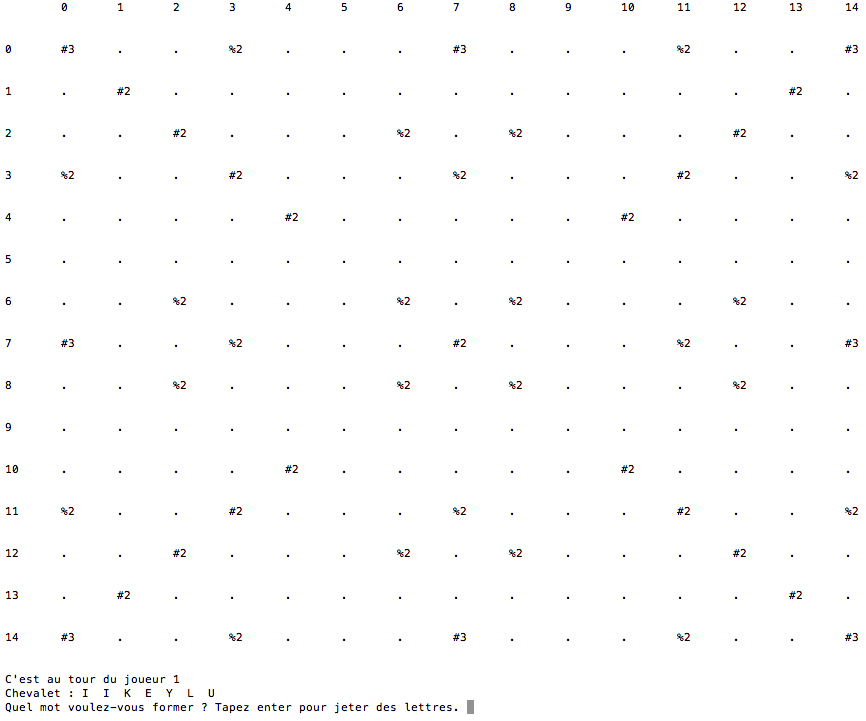

 
 
 
  
  
 
 
 
 
 
 
 
 
 
 
 

# 
INFO-H-100 : Projet 2 

 
 

## 
Scrabble

 
 
 
 

## 
Marceau Lecomte et Nikita Marchant

 
 

 
 
 
 

 
 
 
  

 
 
 
 

 
 

 
 
 
 

 
 
 
 
 
 

## Repésentation des données
 

### Dictionnaire

Tuple de l'ensemble des mots du dictionnaire.

### Plateau

Matrice (liste de listes) : chaque élément contenant soit un tuple (si la case est "vide") soit une lettre (string) en majuscule.
Chaque élément de la liste représente une colonne, chaque sous-liste représente une ligne.

A la création du plateau, les éléments sont des tuples (a,b), où a est le multiplicateur du mot qu'on posera sur la case, et b le multiplicateur de la lettre qu'on posera sur la case.
Par la suite, les tuples seront remplacés par des lettres.

Exemple : 

    [
    [(3, 1), (1, 1), (1, 1), (1, 2), (1, 1), (1, 1), (1, 1), (3, 1), (1, 1), (1, 1), (1, 1), (1, 2), (1, 1), (1, 1), (3, 1)],
    [(1, 1), (2, 1), (1, 1), (1, 1), (1, 1), (1, 1), (1, 1), (1, 1), (1, 1), (1, 1), (1, 1), (1, 1), (1, 1), (2, 1), (1, 1)],
    [(1, 1), (1, 1), (2, 1), (1, 1), (1, 1), (1, 1), (1, 2), (1, 1), (1, 2), (1, 1), (1, 1), (1, 1), (2, 1), (1, 1), (1, 1)],
    [(1, 2), (1, 1), (1, 1), (2, 1), (1, 1), (1, 1), (1, 1), (1, 2), (1, 1), (1, 1), (1, 1), (2, 1), (1, 1), (1, 1), (1, 2)],
    [(1, 1), (1, 1), (1, 1), (1, 1), (2, 1), (1, 1), (1, 1), (1, 1), (1, 1), (1, 1), (2, 1), (1, 1), (1, 1), (1, 1), (1, 1)],
    [(1, 1), (1, 1), (1, 1), (1, 1), (1, 1), (1, 1), (1, 1), (1, 1), (1, 1), (1, 1), (1, 1), (1, 1), (1, 1), (1, 1), (1, 1)],
    [(1, 1), (1, 1), (1, 2), (1, 1), (1, 1), (1, 1), (1, 2), (1, 1), (1, 2), (1, 1), (1, 1), (1, 1), (1, 2), (1, 1), (1, 1)],
    [(3, 1), (1, 1), (1, 1), (1, 2), (1, 1), (1, 1), (1, 1), 'B', 'O', 'N', 'J', 'O', 'U', 'R', (3, 1)],
    [(1, 1), (1, 1), (1, 2), (1, 1), (1, 1), (1, 1), (1, 2), (1, 1), (1, 2), (1, 1), (1, 1), (1, 1), (1, 2), (1, 1), (1, 1)],
    [(1, 1), (1, 1), (1, 1), (1, 1), (1, 1), (1, 1), (1, 1), (1, 1), (1, 1), (1, 1), (1, 1), (1, 1), (1, 1), (1, 1), (1, 1)],
    [(1, 1), (1, 1), (1, 1), (1, 1), (2, 1), (1, 1), (1, 1), (1, 1), (1, 1), (1, 1), (2, 1), (1, 1), (1, 1), (1, 1), (1, 1)],
    [(1, 2), (1, 1), (1, 1), (2, 1), (1, 1), (1, 1), (1, 1), (1, 2), (1, 1), (1, 1), (1, 1), (2, 1), (1, 1), (1, 1), (1, 2)],
    [(1, 1), (1, 1), (2, 1), (1, 1), (1, 1), (1, 1), (1, 2), (1, 1), (1, 2), (1, 1), (1, 1), (1, 1), (2, 1), (1, 1), (1, 1)],
    [(1, 1), (2, 1), (1, 1), (1, 1), (1, 1), (1, 1), (1, 1), (1, 1), (1, 1), (1, 1), (1, 1), (1, 1), (1, 1), (2, 1), (1, 1)],
    [(3, 1), (1, 1), (1, 1), (1, 2), (1, 1), (1, 1), (1, 1), (3, 1), (1, 1), (1, 1), (1, 1), (1, 2), (1, 1), (1, 1), (3, 1)]
    ]

### Joueur

Liste de deux éléments : un chevalet et un entier, représentant les points du joueur.

Exemple : 

    [['L', 'I', 'R', 'M', 'E', 'L', 'U'], 0]

##### Chevalet

Liste de lettres. (Chaque lettre est un String)

Exemple :

    ['L', 'I', 'R', 'M', 'E', 'L', 'U']

### Sac

Liste de lettres. (Chaque lettre est un String)

Exemple :

    ['E', 'E', 'E', 'E', 'E', 'E', 'E', 'E', 'E', 'E', 'E', 'E', 'E', 'E', 'E', 'A', 'A', 'A', 'A', 'A', 'A', 'A', 'A', 'A', 'I', 'I', 'I', 'I', 'I', 'I', 'I', 'I', 'N', 'N', 'N', 'N', 'N', 'N', 'O', 'O', 'O', 'O', 'O', 'O', 'R', 'R', 'R', 'R', 'R', 'R', 'S', 'S', 'S', 'S', 'S', 'S', 'T', 'T', 'T', 'T', 'T', 'T', 'U', 'U', 'U', 'U', 'U', 'U', 'L', 'L', 'L', 'L', 'L', 'D', 'D', 'D', 'G', 'G', 'M', 'M', 'M', 'B', 'B', 'C', 'C', 'P', 'P', 'F', 'F', 'H', 'H', 'V', 'V', 'J', 'Q', 'K', 'W', 'X', 'Y', 'Z']

## Choix algorithmiques
 
### Mots collatéraux
 
#### trouverMotsCollateraux(ARGS)
 

	def trouverMotsCollateraux(plateau, mot, position, direction):
    	mots=[]
    	x=position[0]
    	y=position[1]
    	for lettre in mot:
    	    engendre=motEngendre(plateau, lettre, (x,y), direction)
    	    if estVide(plateau[x][y]): #Si on génère un nouveau mot
    	        engendre.append(True)
    	    else:
    	        engendre.append(False) #Si engendre se base sur une lettre existante
    	    if len(engendre[0])>1:
    	        mots.append(engendre)
    	    x+=direction
    	    y+=abs(direction-1)
    	return mots

On parcourt le plateau aux futurs emplacements du mot qu'on veut placer. Pour chaque case, on garde le mot perpendiculaire engendré (cf motEngendre(ARGS) plus bas).

Si cette case était vide, c'est que le mot perpendiculaire engendré a été formé par la pose de la lettre. On peut donc compter les points qui y sont associés. Si la case était déjà occupée, c'est que le mot perpendiculaire n'a pas été formé par la pose du nouveau mot.

On ajoute un élément à la liste du mot engendre (cf plus bas) qui transmet le fait qu'il faille compter les points du mot ou pas. (utilisé dans la fonction points(ARG) )
  

#### motEngendre(ARGS)

	def motEngendre(plateau, lettre, position, direction):
    	x=position[0]
    	y=position[1]
    	temp = plateau[x][y]
    	plateau[x][y] = lettre
    	lettreActuelle = plateau[x][y]
    	while not estVide(lettreActuelle):
    	    x-=abs(direction-1)
    	    y-=direction
    	    lettreActuelle = plateau[x][y]
    	x+=abs(direction-1)
    	y+=direction
    	pos=(x,y)
    	dir=abs(direction-1)
    	lettreActuelle = plateau[x][y]
    	motEngendre = ''
    	while not estVide(lettreActuelle):
    	    motEngendre += lettreActuelle
    	    x+=abs(direction-1)
    	    y+=direction
    	    lettreActuelle = plateau[x][y]
    	plateau[position[0]][position[1]] = temp
    	return [motEngendre, pos, dir, True] # True=estCollateral
Cette fonction trouve le mot (perpendiculairement à la pose du mot) engendré par une lettre :

1. On boucle vers la gauche ou le haut (dépendant que le mot est placé verticalement ou horizontalement, respectivement), jusqu'à ce qu'on tombe sur une case vide.
2. On repars de la dernière case non vide (dont on note la position, qui est celle de la première lettre du mot engendré)
3. On boucle vers la droite ou le bas, jusqu'à tomber sur une case vide (En ayant pris soin de remplir provisoirement la case de départ !), en notant chaque lettre
4. On a le mot engendré, la position de sa première lettre (utile pour le comptage des points) et sa direction (perpendiculaire à celle de la pose du mot)

Le dernier élément de la liste retournée signifie que le mot engendré ne peut représenter un "Scrabble" dans le comptage des points.

## Manuel d'utilisation
 
Voici le déroulement d'une partie-type du jeu de Scrabble simplifié.
Les règles du jeu diffèrent quelque peu des règles officielles du Scrabble.

Le but du jeu est de poser des mots les plus longs possible, à partir des lettres situées dans le chevalet du joueur.

Chaque lettre valant un certain nombre de points, il peut être intéressant de placer des lettres à plus fortes valeurs.
(Les détails pratiques du calcul des points sont affichés plus bas)

### Déroulement du jeu

Commencez par spécifier au programme le **nombre de joueurs** qui participent. (Maximum 4)

#### Premier tour

Le plateau de jeu est affiché, ainsi que le chevalet du joueur.

Au premier tour, le premier joueur est **obligé** de placer le mot tel qu'une des lettres soit positionnée au centre du plateau. Il peut également choisir de ne rien placer, et de se débarrasser de certaines lettres. (Il peut aussi choisir de ne se débarrasser d'aucune lettre.)

Une fois qu'il a choisi le(s) lettre(s) dont il veut se débarrasser , le chevalet est re-rempli à partir du sac et c'est au tour du joueur suivant.

#### Tours suivants

Une fois qu'un premier mot est placé sur le plateau de jeu, chaque nouveau mot doit avoir un point de contact avec les lettres déjà présentes sur le plateau.

Les joueurs peuvent aussi se baser sur les lettres déjà posées pour construire leurs nouveau mots.
Par exemple, si `jour` est déjà présent en jeu, il est possible de former `bonjour` en ayant uniquement `b` `o` `n` dans son chevalet.

Les joueurs peuvent aussi choisir de ne rien placer, et de se débarrasser de certaines lettres ou de passer leur tour, de la même manière qu'au premier tour

### Fin de la partie

Le jeu continue jusqu'à ce que le sac soit vide.
Dès que cela arrive, le joueur qui a le plus de points gagne la partie.

### Calcul des points

#### Points par lettre

Chaque lettre posée vaut un certain nombre de points :
E, 1; A, 1; I, 1; N, 1; O, 1; R, 1; S, 1; T, 1; U, 1; L, 1; D, 2; G, 2; M, 2; B, 3; C, 3; P, 3; F, 4; H, 4; V, 4; J, 8; Q, 8; K, 10; W, 10; X, 10; Y, 10 et Z. 10 points

#### Cases multiplicatrices

##### Mot compte double

Lorsqu'un joueur pose une lettre sur une case "mot compte double" ( `#2` sur le plateau de jeu), le total des points engendré par la pose du mot est doublé.

##### Mot compte triple

Lorsqu'un joueur pose une lettre sur une case "mot compte triple" ( `#3` sur le plateau de jeu), le total des points engendré par la pose du mot est triplé.

##### Lettre compte double

Lorsqu'un joueur pose une lettre sur une case "lettre compte double" ( `%2` sur le plateau de jeu), les points pour cette lettre sont doublés.

##### Lettre compte triple

Lorsqu'un joueur pose une lettre sur une case "lettre compte triple" ( `%3` sur le plateau de jeu), les points pour cette lettre sont triplés.

#### Scrabble

Si un joueur pose toutes les lettres de son chevalet (7) d'un seul coup, il obtient un bonus de 50 points.

#### Mots engendrés

Lors de la pose d'un mot sur le plateau, il est possible (et même probable) que certaines lettres du mot complètent ou forment un autre mot sur le plateau. Auquel cas, les points pour ce mot sont ajoutés au joueur.

En reprenant l'exemple ci-dessus, si `jour` est déjà présent en jeu, il est possible de poser `bon` et d'obtenir les points pour `bonjour`.